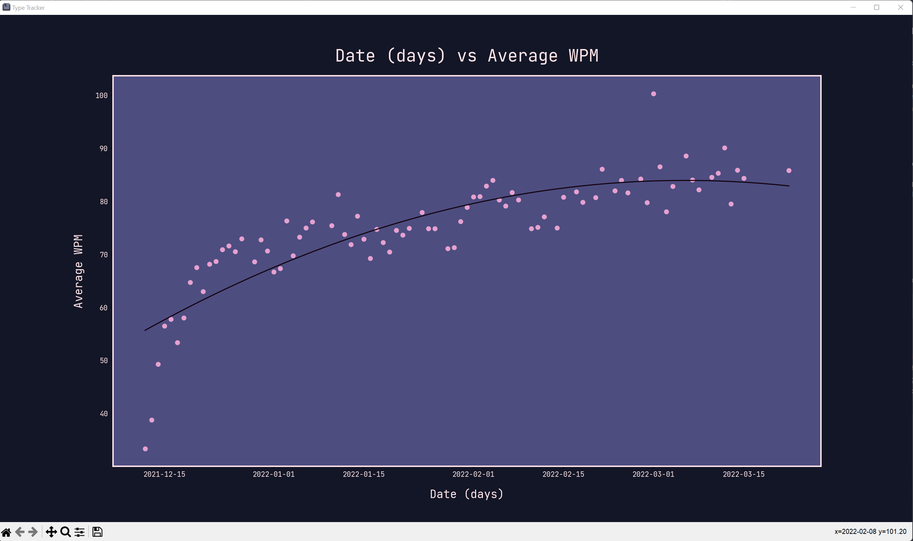

<h1>TypeTracker</h1>
<h3>Matteo Golin</h3>

[](https://opensource.org/licenses/MIT)

TypeTracker is a data analysis software that allows for easy interpretation of statistics provided by 
[Keybr][1].


## Downloading Keybr Stats
- Go to [Keybr.com][1].
- Create an account where your data will be saved.
- Start typing to collect your data!
- Click on ["Profile"][2] and scroll to the bottom of the page.
- Click download data and save the file to the 'resources' folder of this repository.
- DO NOT change the file name, leave it as 'typing-data.json'.

## Software Usage
This software can be used via a user interface in the console window, or can be used via commandline arguments.

Users may pick from a set of different data types to plot on the X or Y axis to analyze their data in many ways.
Additionally, the user can choose a date range from which their data will be pulled, so not all data is plotted every
time. Finally, the user can pick the degree of the polynomial used to interpret the trend of their data.

The same data cannot be plotted on the X or Y, and at least one of the upper or lower values of the data range must be
found in the data from Keybr.

### Command Line Usage
The following command will show the documentation for command line arguments.
```
py interface.py -h
```

### Example Plot
The following image shows an example plot of my typing speed when I first started using Keybr.com. It plots my average 
WPM against the date it was recorded, including a quadratic interpolation trend-line.


### Console Interface Usage
- When the program is run, the user's all-time statistics will be displayed.
- The user will be prompted to select which values should be plotted along the X and Y axes.
- The user will be prompted to enter a range of dates from which data will be selected.
- Finally, the user will be prompted to select the degree of the polynomial that will be used to interpolate the data.
  - It is recommended to use a degree of either 1 or 2, 1 for a trend line and 2 for a curve of best fit.

The graph will then be displayed until the user closes it, at which point they can press 'Enter' to continue plotting
data, or type 'Q' to quit.

## Installation
Python 3.10.0 or later must be installed.
This software makes use of the following modules:
- Matplotlib
- Numpy

<!--Links-->
[1]: https://www.keybr.com/
[2]: https://www.keybr.com/profile